# Django Website


## Features
- authentication
- category filter 
- profile 
- support language


To run the project, download the project, put it in the vscode editor and type python manage.py runserver in the terminal.
```sh
python manage.py runserver
```

Bu proje için ekran görüntüleri:
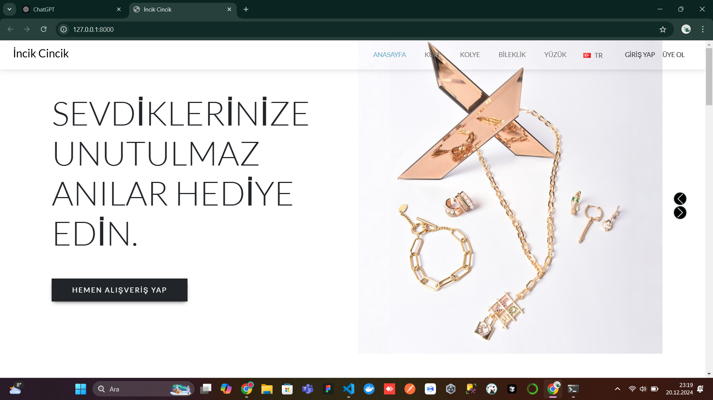
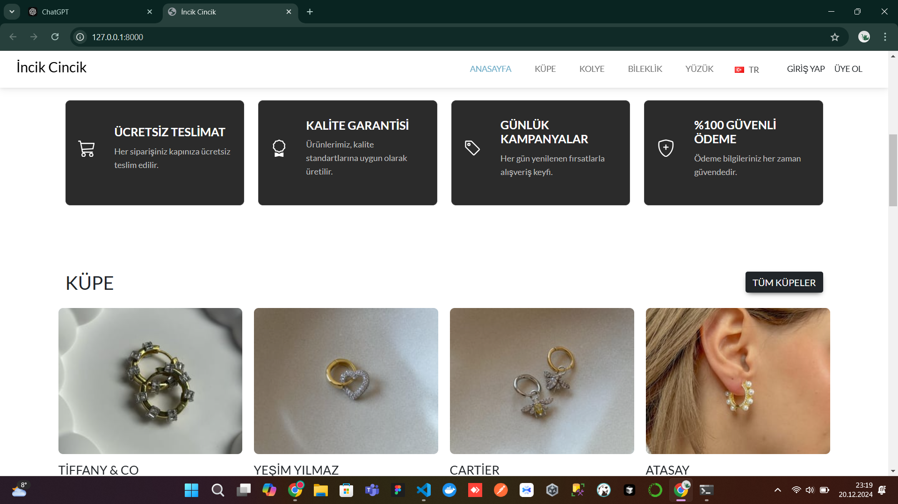
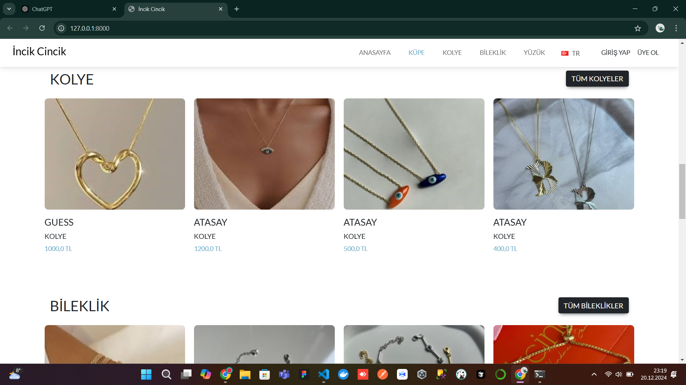
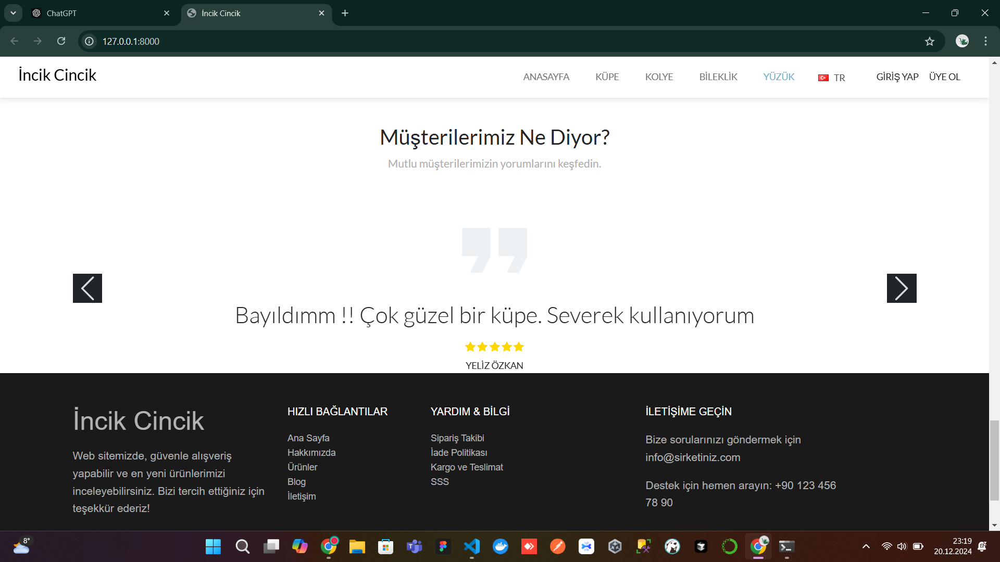
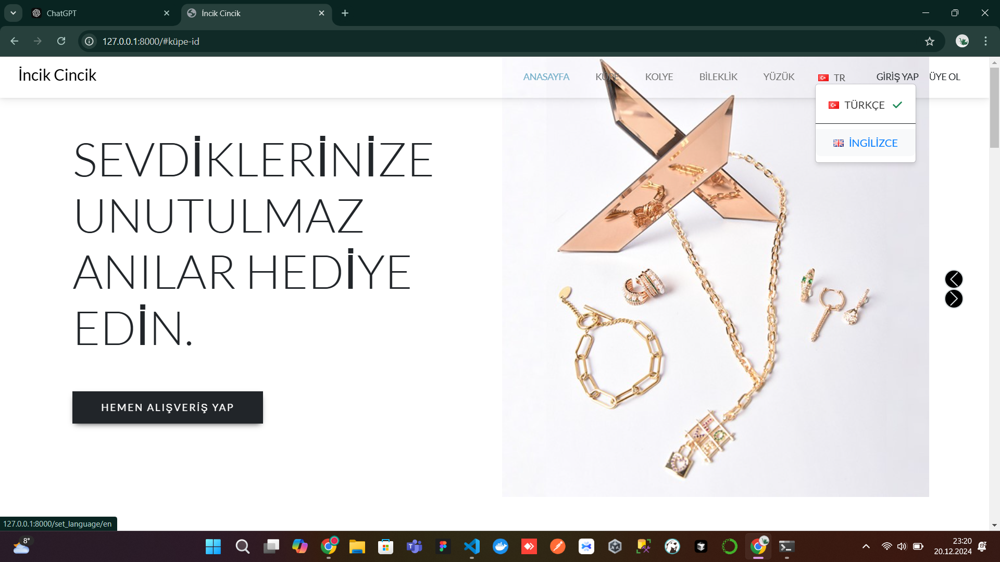

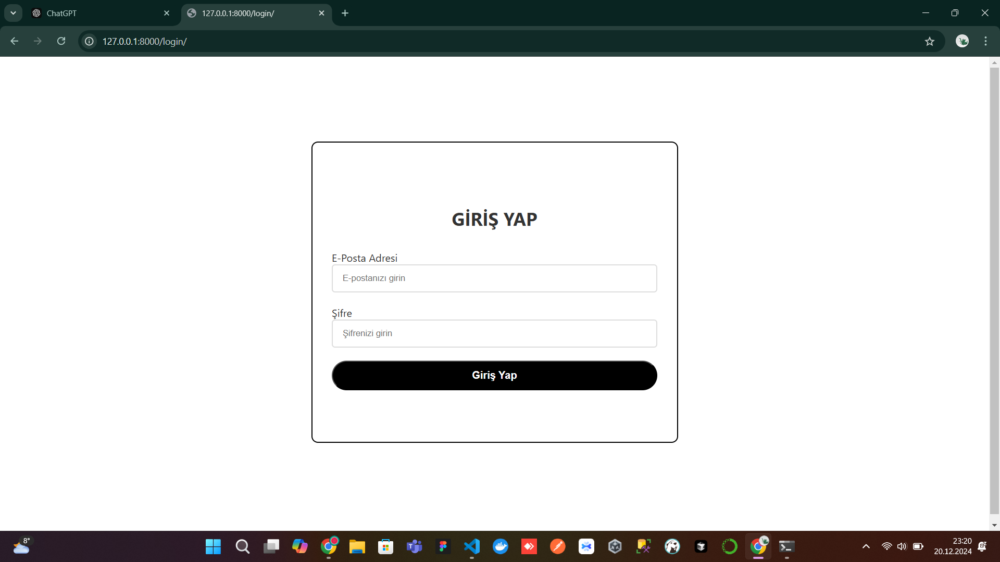
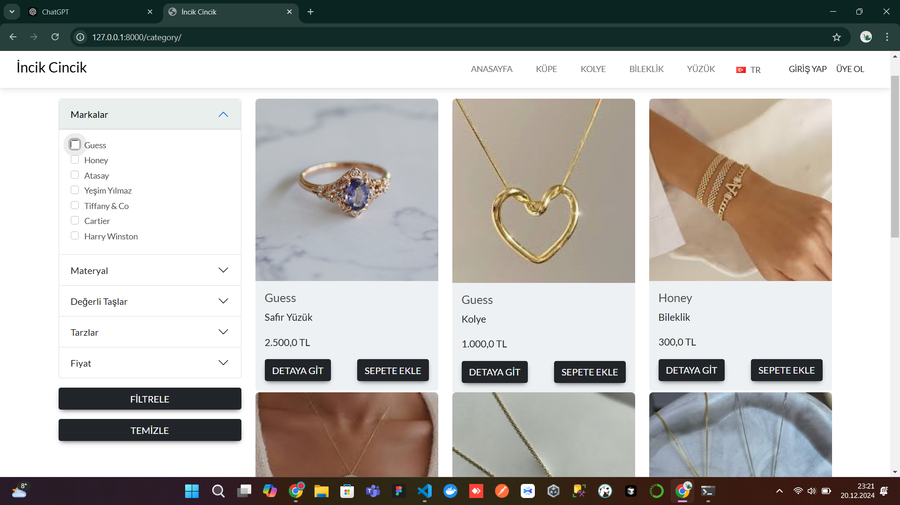
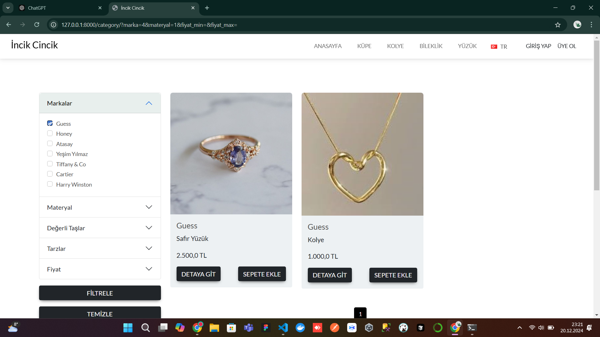
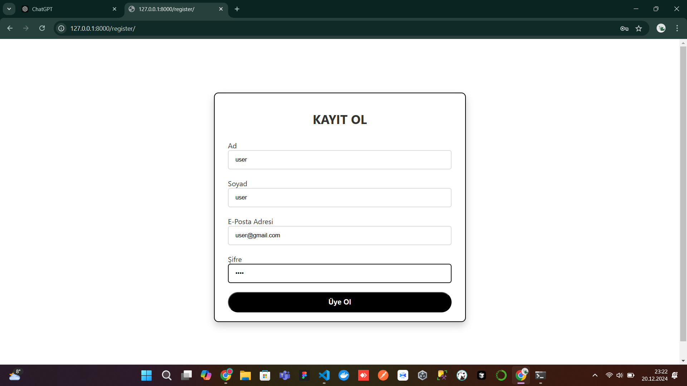
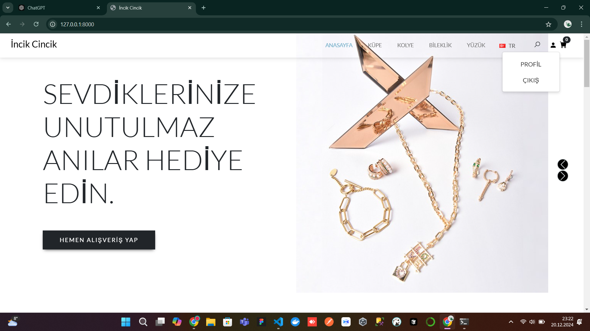
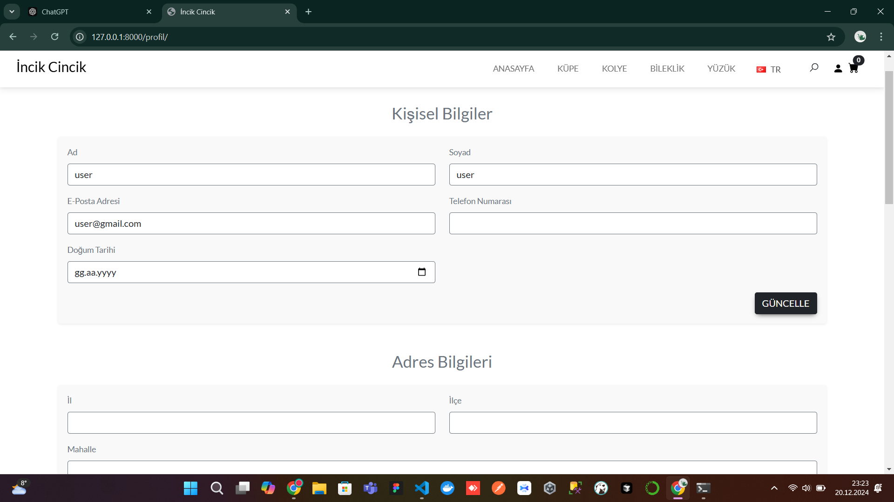
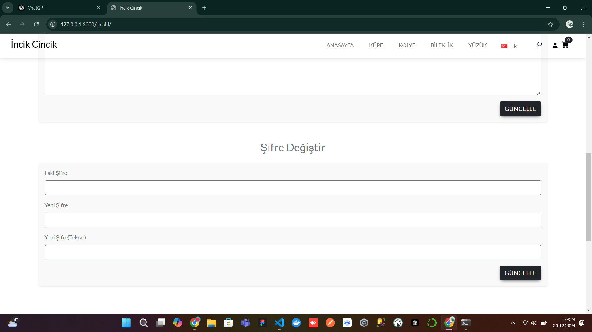
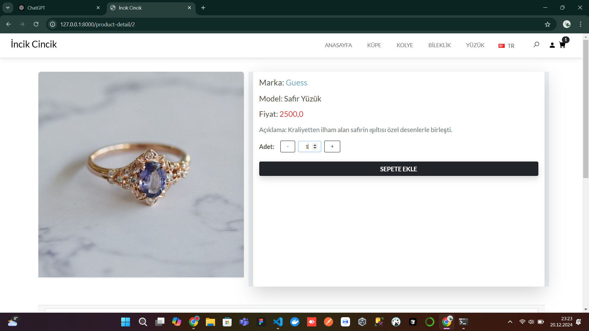
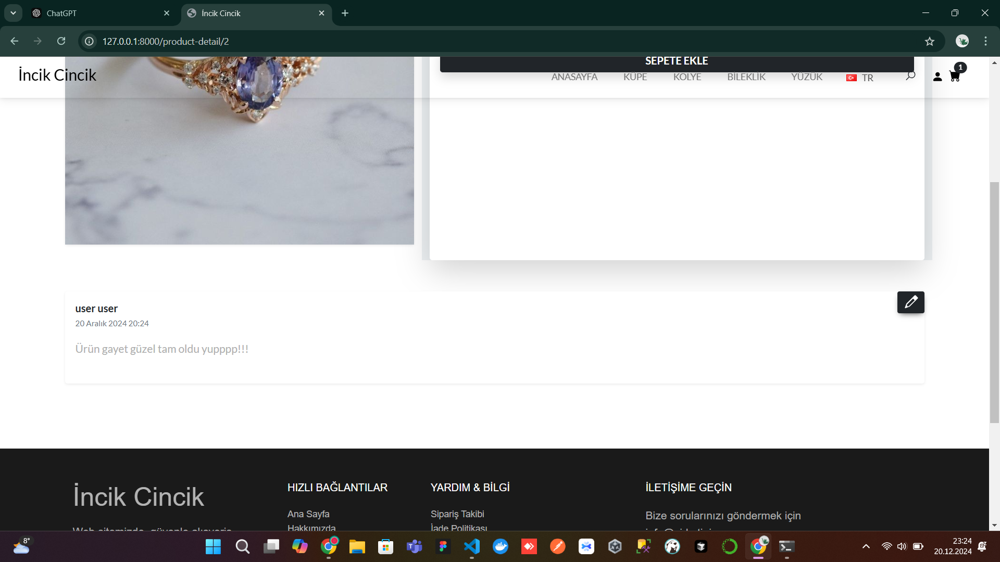
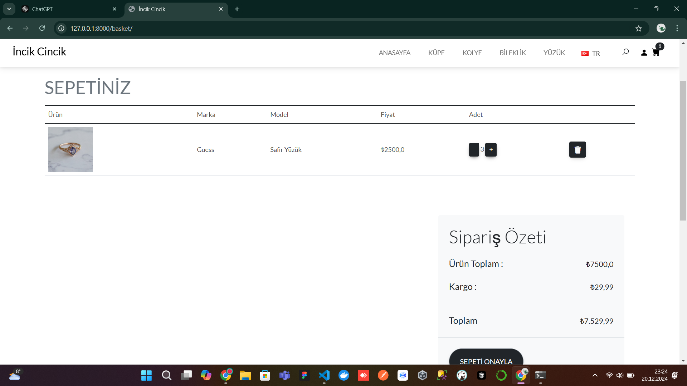


